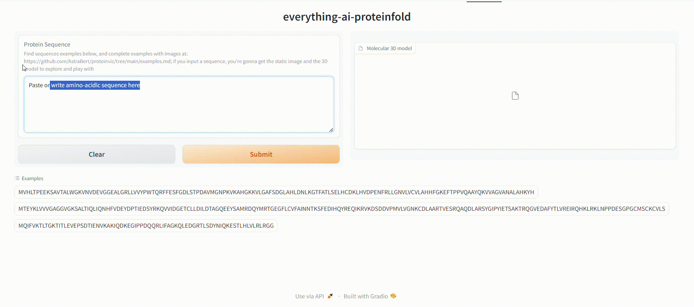

<h1 align="center">proteinviz</h1>
<h2 align="center">Your simple and open-source alternative to AlphaFold3🚀</h2>

> _**DISCLAIMER**: this space is designed for research purposes only. Its accuracy has not been tested and it does not compare to the one of AlphaFold3. However, the core concept of protein folding prediction and the intuitive user interface make it a good alternative to Google Deepmind's tool_

This is the code for the HuggingFace space: [as-cle-bert/proteinviz](https://huggingface.co/spaces/as-cle-bert/proteinviz), make sure to check it out!

### How does it work?

proteinviz lets you predict the 3D structure of a protein starting from its amino-acidic sequence, as you can see here:


It does this by exploiting [facebook/esmfold_v1](https://huggingface.co/facebook/esmfold_v1) protein folding model by Facebook-Meta, available on HuggingFace Hub. 

The model predicts the positions of the amino-acids and its predictions get turned into a PDB file (Protein DataBase format). This file contains lots of stereochemical and positional metadata related to amino-acids and their atoms, instructing visualization servers on how the protein should be represented.

The protein is then visualized through a complex interaction leveraging _biopandas_ (to read the PDB file), _plotly_ and _graphein_ to actually build the image (which is indeed a backbone structure representation) and _PIL_ to show it.

Finally, the 3D representation of the molecule is written to an HTML object that gets displayed on your browser, directly.



Everything is easily rendered through a Gradio interface.

### How can I reproduce it on my computer?

>⚠️ _**WARNING**: You should reproduce this Gradio app if and only if you have a good GPU, otherwise it might crash_

You first need to clone this repo:

```bash
git clone https://github.com/AstraBert/proteinviz.git
```

After that, you navigate to the cloned repository and install the needed dependencies:

```bash
python3 -m pip install -r requirements.txt
```

Now that you have everything set, you can launch the application:

```bash
python3 app.py
```

You should see the application running on `localhost:7860` or `0.0.0.0:7860` after a while.

### License and rights of usage

The hereby presented software is open-source and distributed under MIT license.

As stated before, the project was developed for research purposes and must be used only in this sense.

### Citations

- Rego N, Koes D. 3Dmol.js: molecular visualization with WebGL. Bioinformatics. 2015;31(8):1322-1324. doi:10.1093/bioinformatics/btu829

