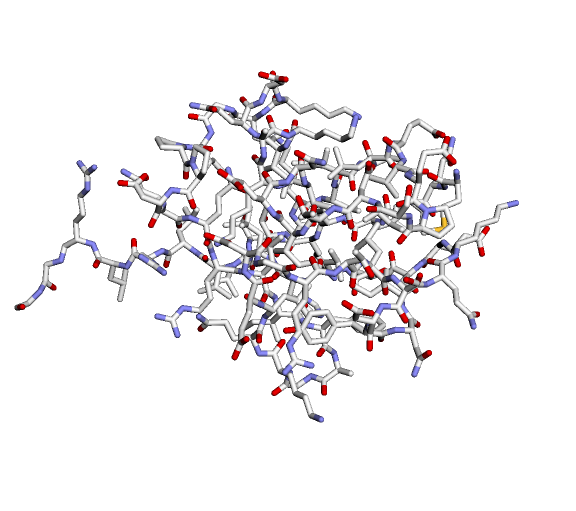

| Protein | Sequence | Predicted Structure | HTML 3D Model |
| ------- | -------- | ------------------- |---------------|
| Hemoglobin | MVHLTPEEKSAVTALWGKVNVDEVGGEALGRLLVVYPWTQRFFESFGDLSTPDAVMGNPKVKAHGKKVLGAFSDGLAHLDNLKGTFATLSELHCDKLHVDPENFRLLGNVLVCVLAHHFGKEFTPPVQAAYQKVVAGVANALAHKYH |  | [hemoglobin.html](./imgs/hemoglobin.html) |
| HRAS GTPase | MTEYKLVVVGAGGVGKSALTIQLIQNHFVDEYDPTIEDSYRKQVVIDGETCLLDILDTAGQEEYSAMRDQYMRTGEGFLCVFAINNTKSFEDIHQYREQIKRVKDSDDVPMVLVGNKCDLAARTVESRQAQDLARSYGIPYIETSAKTRQGVEDAFYTLVREIRQHKLRKLNPPDESGPGCMSCKCVLS |  | [hemoglobin.html](./imgs/hras_gtpase.html) |
| Ubiquitin-Ribosomal Protein (S27) | MQIFVKTLTGKTITLEVEPSDTIENVKAKIQDKEGIPPDQQRLIFAGKQLEDGRTLSDYNIQKESTLHLVLRLRGG |  | [hemoglobin.html](./imgs/ribo_prot.html) |